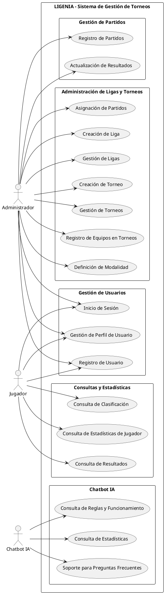
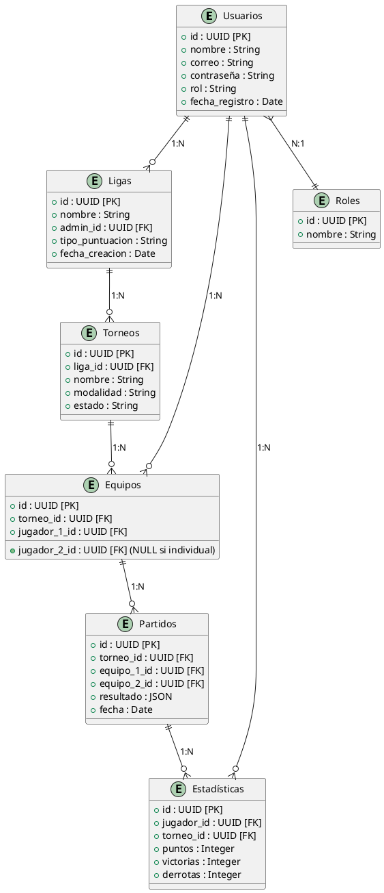
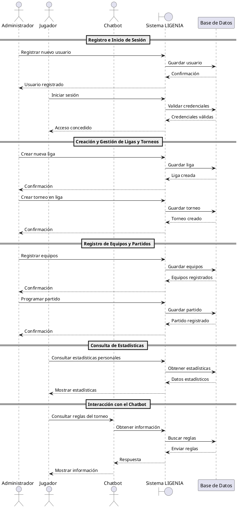

# Análisis del Proyecto

## 📌 Introducción
Este documento presenta un análisis detallado del proyecto **LIGENIA**, una plataforma para la gestión de ligas y torneos deportivos con funcionalidades avanzadas de automatización y consulta de estadísticas. Se incluyen los requisitos del sistema, diagramas UML y consideraciones clave para el desarrollo del MVP.

## 📖 Tabla de Contenidos
1. [Valor y Competidores](#valor-y-competidores)
2. [Requisitos del Sistema](#requisitos-del-sistema)
3. [Diagramas Explicativos](#diagramas-explicativos)
   - [Diagrama de Casos de Uso](#diagrama-de-casos-de-uso)
   - [Diagrama Entidad-Relación (ERD)](#diagrama-entidad-relacion-erd)
   - [Diagrama de Secuencia](#diagrama-de-secuencia)
4. [Conclusión](#conclusion)

## 📌 Valor y Competidores

Antes de iniciar la fase de análisis y diseño de **LIGENIA**, es esencial evaluar las soluciones existentes en el mercado para identificar oportunidades de mejora y diferenciación. A continuación, se presentan tres plataformas destacadas en la gestión de ligas y torneos de pádel, junto con sus fortalezas y debilidades:

| **Competidor**    | **Fortalezas** | **Debilidades** |
|------------------|--------------|--------------|
| **Padel Manager** | Gestión automática de competiciones, notificaciones en tiempo real, generación rápida de cuadros de competición. | Enfoque limitado en automatización, con menos funcionalidades de interacción social o análisis detallado. |
| **Xporty** | Flexibilidad en la organización de torneos, asignación automática de recursos, plataforma multideporte. | Interfaz menos intuitiva, soporte y actualizaciones menos frecuentes. |
| **Enjore** | Fomenta la interacción social entre jugadores y equipos, gestión integral de torneos. | Complejidad inicial alta, opciones de personalización limitadas. |

### **Valor Añadido de LIGENIA**

Basándonos en el análisis de estas plataformas, **LIGENIA** se diferenciará a través de las siguientes estrategias:

- **Integración de Chatbot IA**: Proporciona respuestas automáticas, estadísticas personalizadas y mejora la interacción con los usuarios.
- **Análisis Avanzado de Estadísticas**: Permite un seguimiento detallado del rendimiento de jugadores y equipos, más allá de datos básicos.
- **Experiencia de Usuario Intuitiva**: Interfaz moderna y fácil de usar que minimiza la curva de aprendizaje.
- **Personalización Extensiva**: Adaptación flexible para organizadores, con branding y formatos de competición ajustables.
- **Escalabilidad Multideporte**: Aunque inicia con pádel, está diseñado para expandirse a otros deportes en el futuro.

**Referencia Visual:** Documento gráfico incluido en el directorio "diagramas".

Antes de iniciar la fase de análisis y diseño de **LIGENIA**, es esencial evaluar las soluciones existentes en el mercado para identificar oportunidades de mejora y diferenciación. A continuación, se presentan tres plataformas destacadas en la gestión de ligas y torneos de pádel, junto con sus fortalezas y debilidades:

| **Competidor**    | **Fortalezas** | **Debilidades** |
|------------------|--------------|--------------|
| **Padel Manager** | Gestión automática de competiciones, notificaciones en tiempo real, generación rápida de cuadros de competición. | Enfoque limitado en automatización, con menos funcionalidades de interacción social o análisis detallado. |
| **Xporty** | Flexibilidad en la organización de torneos, asignación automática de recursos, plataforma multideporte. | Interfaz menos intuitiva, soporte y actualizaciones menos frecuentes. |
| **Enjore** | Fomenta la interacción social entre jugadores y equipos, gestión integral de torneos. | Complejidad inicial alta, opciones de personalización limitadas. |

### **Valor Añadido de LIGENIA**

Basándonos en el análisis de estas plataformas, **LIGENIA** se diferenciará a través de las siguientes estrategias:

- **Integración de Chatbot IA**: Proporciona respuestas automáticas, estadísticas personalizadas y mejora la interacción con los usuarios.
- **Análisis Avanzado de Estadísticas**: Permite un seguimiento detallado del rendimiento de jugadores y equipos, más allá de datos básicos.
- **Experiencia de Usuario Intuitiva**: Interfaz moderna y fácil de usar que minimiza la curva de aprendizaje.
- **Personalización Extensiva**: Adaptación flexible para organizadores, con branding y formatos de competición ajustables.
- **Escalabilidad Multideporte**: Aunque inicia con pádel, está diseñado para expandirse a otros deportes en el futuro.

## 📌 Requisitos del Sistema

### Requisitos Funcionales (RF)
| ID  | Descripción |
|-----|------------|
| RF1 | Registro e inicio de sesión de usuarios |
| RF2 | Gestión de roles (Administrador, Jugador) |
| RF3 | Recuperación y cambio de credenciales |
| RF4 | Creación y administración de ligas |
| RF5 | Creación y gestión de torneos dentro de las ligas |
| RF6 | Configuración de reglas y puntuaciones |
| RF7 | Registro y gestión de equipos |
| RF8 | Asignación y programación de partidos |
| RF9 | Registro de resultados y actualización de clasificaciones |
| RF10 | Visualización de estadísticas |
| RF11 | Consulta de resultados históricos |
| RF12 | Generación de reportes de rendimiento |
| RF13 | Consulta de reglas y funcionamiento del sistema |
| RF14 | Consulta sobre estadísticas personales y globales |
| RF15 | Soporte automatizado para preguntas frecuentes |

### Requisitos No Funcionales (RNF)
| ID  | Descripción |
|-----|------------|
| RNF1 | Autenticación segura mediante OAuth o JWT |
| RNF2 | Protección de datos personales con cifrado |
| RNF3 | Control de acceso según roles |
| RNF4 | Respuesta en menos de 2 segundos |
| RNF5 | Soporte para concurrencia de múltiples usuarios |
| RNF6 | Escalabilidad para múltiples deportes |
| RNF7 | Disponibilidad mínima del 99.9% |
| RNF8 | Actualizaciones sin interrupción |
| RNF9 | Interfaz intuitiva y responsive |

## 📌 Diagramas Explicativos

### 🔹 Diagrama de Casos de Uso

Este diagrama representa las interacciones entre los actores principales del sistema (**Administrador, Jugador y Chatbot IA**) y las funcionalidades del sistema. Se han identificado los principales casos de uso para el MVP, agrupándolos en categorías de gestión de usuarios, torneos, estadísticas y chatbot.

#### 📌 **Entidades Principales**

1. **Administrador**
   - Crea y gestiona ligas y torneos.
   - Gestiona resultados de partidos.
   - Administra los perfiles de jugadores.

2. **Jugador**
   - Se registra y accede a su perfil.
   - Consulta estadísticas personales y de torneos.
   - Se une a ligas y torneos.

3. **Chatbot IA**
   - Responde preguntas frecuentes sobre ligas y torneos.
   - Proporciona estadísticas de jugadores y equipos.
   - Aprende de interacciones previas para mejorar respuestas.

#### 🎯 **Casos de Uso Identificados**

#### 📌 **Descripción de Casos de Uso**

**Gestión de Usuarios**
- **UC1 - Registro de Usuario**: Permite a un usuario crear una cuenta en la plataforma.
- **UC2 - Inicio de Sesión**: Autenticación de usuarios en el sistema.
- **UC3 - Gestión de Perfil de Usuario**: Modificación de datos personales.

**Administración de Ligas y Torneos**
- **UC4 - Creación de Liga**: Un administrador puede definir y gestionar ligas.
- **UC5 - Gestión de Ligas**: Edición de reglas, puntuaciones y estructura de una liga.
- **UC6 - Creación de Torneo**: Generar torneos dentro de una liga.
- **UC7 - Gestión de Torneos**: Modificación de detalles de torneos.
- **UC8 - Registro de Equipos en Torneos**: Agregar jugadores o equipos.
- **UC9 - Definición de Modalidad**: Determinar si un torneo es individual o por equipos.
- **UC10 - Asignación de Partidos**: Organizar los encuentros dentro del torneo.

**Gestión de Partidos**
- **UC11 - Registro de Partidos**: Crear partidos y definir fechas.
- **UC12 - Actualización de Resultados**: Introducir los resultados de los partidos.

**Consultas y Estadísticas**
- **UC13 - Consulta de Clasificación**: Ver la tabla de posiciones en una liga.
- **UC14 - Consulta de Estadísticas de Jugador**: Acceder a estadísticas individuales.
- **UC15 - Consulta de Resultados**: Ver detalles de los partidos finalizados.

**Chatbot IA**
- **UC16 - Consulta de Reglas y Funcionamiento**: Preguntas sobre el sistema y las reglas.
- **UC17 - Consulta de Estadísticas**: Consultas automáticas sobre jugadores y equipos.
- **UC18 - Soporte para Preguntas Frecuentes**: Asistencia automatizada sobre el uso de la plataforma.

**Referencia Visual:** Documento gráfico incluido en el directorio "diagramas".

### 🔹 Diagrama Entidad-Relación (ERD)

Este diagrama representa el modelo de datos del sistema **LIGENIA**, mostrando las principales entidades y sus relaciones. Se han definido las tablas esenciales para gestionar usuarios, ligas, torneos y sus respectivos equipos y partidos.

#### 📌 **Descripción del Diagrama**

El modelo de datos está compuesto por las siguientes entidades:

- **Usuarios**: Contiene información sobre los usuarios registrados, incluyendo su nombre, correo y rol dentro del sistema.
- **Ligas**: Representa las ligas organizadas dentro de la plataforma, cada una gestionada por un administrador.
- **Torneos**: Cada liga puede contener múltiples torneos, definidos con su modalidad y estado.
- **Equipos**: Entidad que agrupa jugadores dentro de un torneo, permitiendo modalidades individuales o por parejas.
- **Partidos**: Representa los encuentros entre equipos en un torneo, almacenando resultados y fechas.
- **Estadísticas**: Guarda el desempeño de los jugadores en los torneos, con datos como puntos, victorias y derrotas.
- **Roles**: Define los distintos tipos de usuarios dentro del sistema, facilitando la gestión de permisos y accesos.

**Referencia Visual:** Documento gráfico incluido en el directorio "diagramas".

### 🔹 Diagrama de Secuencia

Este diagrama representa el flujo de mensajes entre los actores del sistema y las entidades clave de **LIGENIA**. Se ha diseñado para visualizar las interacciones más importantes, como el registro de usuarios, la gestión de torneos, la actualización de resultados y las consultas al chatbot.

#### 📌 **Descripción del Diagrama**

El diagrama muestra las siguientes interacciones principales:

1. **Registro e Inicio de Sesión:**
   - El administrador registra nuevos usuarios en la plataforma.
   - Los jugadores pueden iniciar sesión y autenticar sus credenciales contra la base de datos.

2. **Creación y Gestión de Ligas y Torneos:**
   - Los administradores crean ligas y torneos, los cuales son almacenados en la base de datos.

3. **Registro de Equipos y Partidos:**
   - Los administradores registran equipos y programan partidos dentro de los torneos.

4. **Consulta de Estadísticas:**
   - Los jugadores pueden consultar estadísticas personales que son recuperadas de la base de datos.

5. **Interacción con el Chatbot:**
   - El chatbot responde preguntas sobre reglas y funcionamiento del sistema.
   - Consulta información en la base de datos y proporciona respuestas automáticas a los jugadores.

**Referencia Visual:** Documento gráfico incluido en el directorio "diagramas".

## 📌 Conclusión
El análisis realizado proporciona una visión clara y estructurada del sistema **LIGENIA**, estableciendo las bases para su implementación. Se han definido los requisitos funcionales y no funcionales, junto con diagramas explicativos que detallan su funcionamiento.

🚀 *LIGENIA está listo para su desarrollo.*

