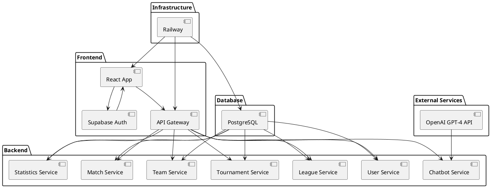

# Diseño de Componentes del Sistema LIGENIA

## Introducción

Este documento describe el diagrama de componentes del sistema LIGENIA, una plataforma para la gestión de ligas y torneos de pádel. El diagrama ilustra cómo los diferentes módulos del sistema interactúan entre sí, incluyendo la infraestructura de despliegue en Railway.

## 📌 Tabla de Contenidos
1. [Introducción](#introducción)
2. [Explicación de los Componentes y sus Relaciones](#explicación-de-los-componentes-y-sus-relaciones)
   - [Frontend (React App)](#frontend-react-app)
   - [API Gateway](#api-gateway)
   - [Servicios del Backend](#servicios-del-backend)
   - [Database (PostgreSQL)](#database-postgresql)
   - [External Services](#external-services)
   - [Infraestructura de Despliegue (Railway)](#infraestructura-de-despliegue-railway)
3. [Conclusión](#conclusión)

## Explicación de los Componentes y sus Relaciones

1. **Frontend (React App)**:
   - **Descripción**: La aplicación React es la interfaz de usuario que interactúa con los usuarios finales. Se comunica con el `API Gateway` para realizar operaciones en el sistema.
   - **Relaciones**: 
     - Se conecta directamente con `Supabase Auth` para gestionar la autenticación de usuarios.
     - Envía solicitudes al `API Gateway` para interactuar con los servicios del backend.

2. **API Gateway**:
   - **Descripción**: Actúa como un punto de entrada unificado para todas las solicitudes del frontend. Distribuye las solicitudes a los servicios correspondientes en el backend.
   - **Relaciones**: 
     - Recibe solicitudes de la `React App`.
     - Redirige las solicitudes a los servicios de `User`, `League`, `Tournament`, `Team`, `Match`, `Statistics`, y `Chatbot`.

3. **Servicios del Backend**:
   - **User Service**: Gestiona las operaciones relacionadas con los usuarios, como la consulta y actualización de datos.
   - **League Service**: Maneja la creación, actualización y eliminación de ligas.
   - **Tournament Service**: Permite la gestión de torneos dentro de las ligas.
   - **Team Service**: Gestiona la creación y administración de equipos.
   - **Match Service**: Permite la programación y gestión de partidos.
   - **Statistics Service**: Proporciona estadísticas de jugadores y equipos.
   - **Chatbot Service**: Interactúa con el chatbot para responder a consultas sobre reglas y estadísticas.
   - **Relaciones**: 
     - Todos los servicios interactúan con la base de datos `PostgreSQL` para almacenar y recuperar datos.
     - El `Chatbot Service` se comunica con la `OpenAI GPT-4 API` para obtener respuestas inteligentes.

4. **Database (PostgreSQL)**:
   - **Descripción**: Almacena todos los datos relacionados con usuarios, ligas, torneos, equipos, partidos y estadísticas.
   - **Relaciones**: 
     - Es accedida por todos los servicios del backend para operaciones de lectura y escritura.

5. **External Services**:
   - **Supabase Auth**: Gestiona la autenticación de usuarios, proporcionando servicios de inicio y cierre de sesión.
   - **OpenAI GPT-4 API**: Proporciona capacidades de inteligencia artificial para el `Chatbot Service`.

6. **Infraestructura de Despliegue (Railway)**:
   - **Descripción**: Railway es el servicio de hosting que proporciona un entorno unificado para el despliegue del frontend, backend y base de datos.
   - **Relaciones**:
     - Aloja la `React App`, el `API Gateway`, y todos los servicios del backend.
     - Proporciona la base de datos `PostgreSQL` utilizada por el sistema.

## Código en Formato PlantUML

## Conclusión

Este diagrama de componentes proporciona una visión clara de la arquitectura del sistema LIGENIA, destacando cómo los diferentes módulos interactúan entre sí y cómo se despliegan en la infraestructura de Railway. La estructura modular permite una fácil escalabilidad y mantenimiento, asegurando que cada componente pueda ser desarrollado y desplegado de manera independiente. Si necesitas más detalles o ajustes, házmelo saber.