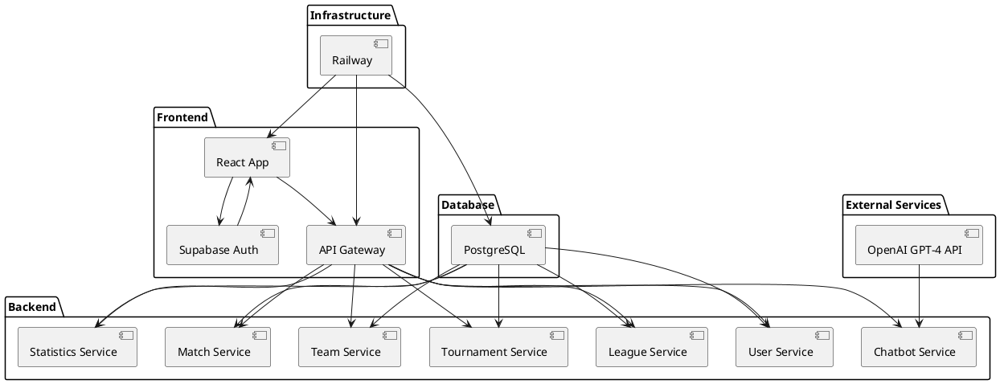

# Diseño de Componentes del Sistema LIGENIA

## Introducción

Este documento describe el diagrama de componentes del sistema LIGENIA, una plataforma para la gestión de ligas y torneos de pádel. El diagrama ilustra cómo los diferentes módulos del sistema interactúan entre sí, incluyendo la infraestructura de despliegue en Railway.

## 📌 Tabla de Contenidos
1. [Introducción](#introducción)
2. [Explicación de los Componentes y sus Relaciones](#explicación-de-los-componentes-y-sus-relaciones)
   - [Frontend (React App)](#frontend-react-app)
   - [API Gateway](#api-gateway)
   - [Servicios del Backend](#servicios-del-backend)
   - [Database (PostgreSQL)](#database-postgresql)
   - [External Services](#external-services)
   - [Infraestructura de Despliegue (Railway)](#infraestructura-de-despliegue-railway)
3. [Componentes del Sistema de Torneos y Rankings (MVP)](#componentes-del-sistema-de-torneos-y-rankings-mvp)
   - [Componentes del Backend](#componentes-del-backend)
   - [Componentes del Frontend](#componentes-del-frontend)
   - [Interacciones entre Componentes](#interacciones-entre-componentes)
4. [Conclusión](#conclusión)

## Explicación de los Componentes y sus Relaciones

1. **Frontend (React App)**:
   - **Descripción**: La aplicación React es la interfaz de usuario que interactúa con los usuarios finales. Se comunica con el `API Gateway` para realizar operaciones en el sistema.
   - **Relaciones**: 
     - Se conecta directamente con `Supabase Auth` para gestionar la autenticación de usuarios.
     - Envía solicitudes al `API Gateway` para interactuar con los servicios del backend.

2. **API Gateway**:
   - **Descripción**: Actúa como un punto de entrada unificado para todas las solicitudes del frontend. Distribuye las solicitudes a los servicios correspondientes en el backend.
   - **Relaciones**: 
     - Recibe solicitudes de la `React App`.
     - Redirige las solicitudes a los servicios de `User`, `League`, `Tournament`, `Team`, `Match`, `Statistics`, y `Chatbot`.

3. **Servicios del Backend**:
   - **User Service**: Gestiona las operaciones relacionadas con los usuarios, como la consulta y actualización de datos.
   - **League Service**: Maneja la creación, actualización y eliminación de ligas.
   - **Tournament Service**: Permite la gestión de torneos dentro de las ligas.
   - **Team Service**: Gestiona la creación y administración de equipos.
   - **Match Service**: Permite la programación y gestión de partidos.
   - **Statistics Service**: Proporciona estadísticas de jugadores y equipos.
   - **Chatbot Service**: Interactúa con el chatbot para responder a consultas sobre reglas y estadísticas.
   - **Relaciones**: 
     - Todos los servicios interactúan con la base de datos `PostgreSQL` para almacenar y recuperar datos.
     - El `Chatbot Service` se comunica con la `OpenAI GPT-4 API` para obtener respuestas inteligentes.

4. **Database (PostgreSQL)**:
   - **Descripción**: Almacena todos los datos relacionados con usuarios, ligas, torneos, equipos, partidos y estadísticas.
   - **Relaciones**: 
     - Es accedida por todos los servicios del backend para operaciones de lectura y escritura.

5. **External Services**:
   - **Supabase Auth**: Gestiona la autenticación de usuarios, proporcionando servicios de inicio y cierre de sesión.
   - **OpenAI GPT-4 API**: Proporciona capacidades de inteligencia artificial para el `Chatbot Service`.

6. **Infraestructura de Despliegue (Railway)**:
   - **Descripción**: Railway es el servicio de hosting que proporciona un entorno unificado para el despliegue del frontend, backend y base de datos.
   - **Relaciones**:
     - Aloja la `React App`, el `API Gateway`, y todos los servicios del backend.
     - Proporciona la base de datos `PostgreSQL` utilizada por el sistema.

## Código en Formato PlantUML

## Componentes del Sistema de Torneos y Rankings (MVP)

### Componentes del Backend

#### 1. Módulo de Gestión de Torneos
- **TournamentController**: Maneja las solicitudes HTTP relacionadas con torneos.
- **TournamentService**: Implementa la lógica de negocio para la gestión de torneos.
- **TournamentRepository**: Gestiona el acceso a datos de torneos en la base de datos.

#### 2. Módulo de Generación de Emparejamientos
- **TournamentMatchesController**: Maneja las solicitudes para generar emparejamientos.
- **SingleEliminationService**: Implementa el algoritmo de generación de emparejamientos para el formato Single Elimination.
- **MatchRepository**: Gestiona el acceso a datos de partidos en la base de datos.

#### 3. Módulo de Inscripción de Equipos
- **TeamController**: Maneja las solicitudes relacionadas con equipos.
- **TeamService**: Implementa la lógica de negocio para la gestión de equipos.
- **TeamRepository**: Gestiona el acceso a datos de equipos en la base de datos.

#### 4. Módulo de Rankings y Clasificaciones
- **PlayerRankingController**: Maneja las solicitudes relacionadas con rankings de jugadores.
- **TournamentStandingsController**: Maneja las solicitudes relacionadas con clasificaciones de torneos.
- **RankingService**: Implementa la lógica para calcular rankings individuales.
- **StatisticRepository**: Gestiona el acceso a datos de estadísticas en la base de datos.

#### 5. Módulo de Notificaciones
- **NotificationController**: Maneja las solicitudes relacionadas con notificaciones.
- **NotificationService**: Implementa la lógica para enviar notificaciones a usuarios.
- **NotificationRepository**: Gestiona el acceso a datos de notificaciones en la base de datos.

### Componentes del Frontend

#### 1. Componentes de Administración de Torneos
- **TournamentCreationForm**: Formulario para crear y editar torneos.
- **TournamentList**: Lista de torneos con opciones de filtrado.
- **TournamentDetail**: Vista detallada de un torneo específico.
- **MatchGenerationPanel**: Panel para generar emparejamientos de un torneo.

#### 2. Componentes de Participación en Torneos
- **TournamentRegistration**: Interfaz para inscribir equipos en torneos.
- **TeamCreation**: Formulario para crear equipos.
- **MyTournaments**: Lista de torneos en los que participa el usuario.

#### 3. Componentes de Visualización de Torneos
- **TournamentBracket**: Visualización del cuadro de eliminación directa.
- **MatchCard**: Tarjeta que muestra información de un partido.
- **MatchResult**: Componente para registrar resultados de partidos.

#### 4. Componentes de Rankings
- **PlayerRankings**: Tabla de rankings de jugadores.
- **TournamentStandings**: Clasificación de un torneo específico.
- **PlayerProfile**: Perfil de jugador con historial de torneos y puntos.

#### 5. Componentes de Notificaciones
- **NotificationCenter**: Centro de notificaciones para usuarios.
- **NotificationBadge**: Indicador de notificaciones no leídas.

### Interacciones entre Componentes

1. **Creación de Torneos**:
   - El administrador utiliza el **TournamentCreationForm** para crear un torneo.
   - El **TournamentController** procesa la solicitud y utiliza el **TournamentService** para crear el torneo.
   - El **NotificationService** envía notificaciones a todos los usuarios.

2. **Inscripción de Equipos**:
   - Los usuarios utilizan el **TournamentRegistration** para inscribir equipos.
   - El **TeamController** procesa la solicitud y utiliza el **TeamService** para registrar el equipo.

3. **Generación de Emparejamientos**:
   - El administrador utiliza el **MatchGenerationPanel** para generar emparejamientos.
   - El **TournamentMatchesController** procesa la solicitud y utiliza el **SingleEliminationService** para generar los partidos.
   - Los partidos generados se visualizan en el **TournamentBracket**.

4. **Registro de Resultados**:
   - Los usuarios o administradores utilizan el **MatchResult** para registrar resultados.
   - El **MatchController** procesa la solicitud y actualiza el estado del partido.
   - El **RankingService** actualiza automáticamente los rankings basados en los resultados.

5. **Visualización de Rankings**:
   - Los usuarios acceden al **PlayerRankings** para ver los rankings actuales.
   - El **PlayerRankingController** procesa la solicitud y utiliza el **RankingService** para calcular los rankings.

## Conclusión

Este diagrama de componentes proporciona una visión clara de la arquitectura del sistema LIGENIA, destacando cómo los diferentes módulos interactúan entre sí y cómo se despliegan en la infraestructura de Railway. La estructura modular permite una fácil escalabilidad y mantenimiento, asegurando que cada componente pueda ser desarrollado y desplegado de manera independiente. Si necesitas más detalles o ajustes, házmelo saber.