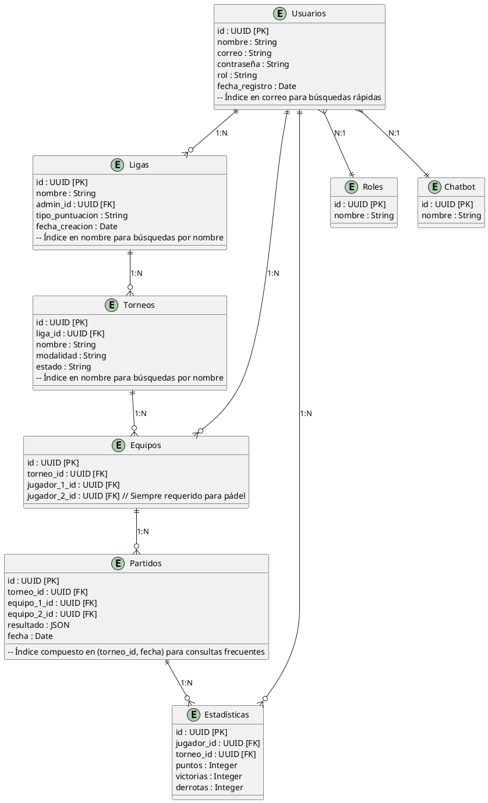

# Modelo de la Base de Datos

## Introducción

Este documento describe el modelo de la base de datos para la plataforma LIGENIA, diseñada para la gestión de ligas y torneos de pádel. El modelo está optimizado para garantizar un rendimiento eficiente y una estructura normalizada, facilitando así la gestión de datos y mejorando la experiencia del usuario.

## Tabla de Contenidos

1. [Introducción](#introducción)
2. [Tabla de Contenidos](#tabla-de-contenidos)
3. [Explicación Detallada de la Base de Datos](#explicación-detallada-de-la-base-de-datos)
4. [Código en Formato PlantUML](#código-en-formato-plantuml)
5. [Optimizaciones Tenidas en Cuenta](#optimizaciones-tenidas-en-cuenta)
6. [Sistema de Torneos y Rankings para el MVP](#sistema-de-torneos-y-rankings-para-el-mvp)
7. [Conclusiones](#conclusiones)

## Explicación Detallada de la Base de Datos

La base de datos de LIGENIA está diseñada para soportar la gestión de usuarios, ligas, torneos, equipos, partidos y estadísticas. Cada entidad está normalizada para asegurar la integridad de los datos y minimizar la redundancia. Las relaciones entre las entidades están claramente definidas para facilitar las consultas y operaciones comunes.

## Código en Formato PlantUML

## Optimizaciones Tenidas en Cuenta

1. **Normalización**: Todas las tablas están en Tercera Forma Normal (3NF) para asegurar que no haya redundancia de datos y que cada atributo dependa únicamente de la clave primaria.

2. **Índices**:
   - Índice en `correo` de `Usuarios` para mejorar las búsquedas por correo electrónico.
   - Índices en `nombre` de `Ligas` y `Torneos` para facilitar las búsquedas por nombre.
   - Índice compuesto en `(torneo_id, fecha)` de `Partidos` para optimizar las consultas que filtran por torneo y fecha.

3. **Relaciones Claras**: Las relaciones entre entidades están claramente definidas para facilitar las operaciones de `JOIN` y mejorar la integridad referencial.

## Sistema de Torneos y Rankings para el MVP

### Formato de Torneos
- Para el MVP, se implementará únicamente el formato de **Single Elimination** (eliminación directa).
- Cada torneo admitirá un número máximo de equipos: 16, 32 o 64.
- Cada equipo estará compuesto por 2 jugadores.

### Sistema de Puntuación
- La puntuación se asignará según la ronda alcanzada en el torneo:
  - Ganador: 100 puntos
  - Finalista: 50 puntos
  - Semifinalistas: 25 puntos
  - Cuartofinalistas: 12 puntos
  - Octavofinalistas: 6 puntos
  - Dieciseisavofinalistas: 3 puntos
  - Treintaidosavofinalistas: 1 punto
- No se permiten puntuaciones decimales. En caso de división con resultado decimal, se redondea a la baja.
- Los puntos se reparten por igual entre los miembros del equipo.

### Equipos y Jugadores
- Los equipos solo pueden inscribirse una vez a cada torneo.
- Un jugador puede participar en diferentes torneos con diferentes compañeros de equipo.
- Las clasificaciones y rankings son individuales, basados en la acumulación de puntos de cada jugador.

### Progresión de Torneos
1. El administrador crea el torneo desde el panel de administración.
2. Se genera una notificación a todos los usuarios en la plataforma.
3. Los usuarios pueden inscribirse hasta alcanzar el máximo de equipos permitido.
4. La fecha límite de inscripción es siempre 3 días antes de la fecha de celebración.
5. Una vez cerrada la inscripción, el administrador realiza el sorteo del cuadro final.
6. Se generan automáticamente los emparejamientos siguiendo el formato de eliminación directa.

### Cálculo de Rankings
- Los rankings se calculan sumando todos los puntos obtenidos por cada jugador en los diferentes torneos.
- El sistema mantiene un ranking actualizado que se recalcula automáticamente al finalizar cada torneo.

## Conclusiones

El modelo de la base de datos de LIGENIA está diseñado para ser eficiente y escalable, soportando las operaciones comunes de gestión de ligas y torneos de pádel. Las optimizaciones aplicadas, como la normalización y el uso de índices, aseguran un rendimiento óptimo y una estructura de datos robusta. Este diseño proporciona una base sólida para el desarrollo y la expansión futura de la plataforma.